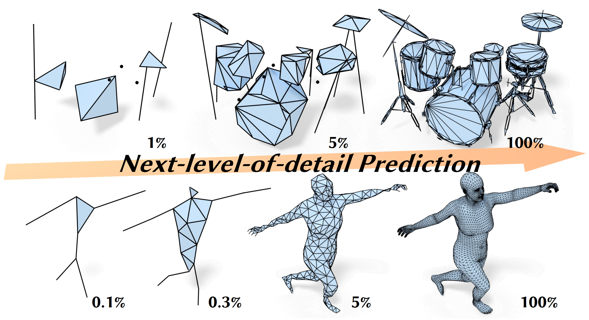

# ARMesh: Autoregressive Mesh Generation via Next-Level-of-Detail Prediction

> [!WARNING]
> This is **still under heavy development**, and the file content may change frequently in the coming days, so please check this repo later.





## Installation

### libpsc

We have packaged our core functionalities into a library called [`libpsc`](https://pypi.org/project/libpsc/), which you can install quite easily:

```bash
pip install trimesh # dependencies
pip install libpsc
```

Supported platforms: 
- python 3.8 ~ 3.13
- linux, windows


You can also find all the wheels [here](https://github.com/Karbo123/armesh/tree/main/assets/libpsc).
The source code is also [available](https://github.com/Karbo123/armesh/tree/main/assets/libpsc-0.2.zip).


### PSC Viewer

We also provide a "progressive simplicial complex" viewer to visualize the simplification and generation process. We have provided two pre-built executables that should run perfectly on Windows and Linux, which can be downloaded from [here](https://github.com/Karbo123/armesh/tree/main/assets/G3dOGL).


You first need to install some dependencies

```bash
pip install fire trimesh easygui libpsc # dependencies

# clone the repo that contains the executable
git clone https://github.com/Karbo123/armesh.git --depth=1
cd armesh
```


For example, to use the executable for visualizing `assets/example-chair.psc`, you may need to:

```
python vis/vis.py assets/example-chair.psc
```

<details>

<summary>If fail to run on Linux</summary>

1. **undefined symbol: omp_get_thread_num**: this often occurs if it does not use the system's OpenMP library. You may preload the system's OpenMP by setting the environment variable, something like: `export LD_PRELOAD="/usr/lib/gcc/x86_64-linux-gnu/9/libgomp.so"`

2. **error while loading shared libraries**: this often occurs if the executable fails to find these libraries. Fortunately, they are available after installing `libpsc`. You can specify the folder where these libraries reside by setting the environment variable `LD_LIBRARY_PATH`. You may do something like:

   ```
   cp /home/graphics/.local/lib/python3.8/site-packages/libpsc.libs/* .
   mv libpng15* libpng15.so.15
   mv libjpeg* libjpeg.so.62
   mv libqhull_r* libqhull_r.so.8.0
   export LD_LIBRARY_PATH=$(pwd)
   ```

</details>


### Experimental Environment

xxx


## Examples

### xxx


## BibTex

If you find our work useful or use any part of our code, please consider citing our paper; your recognition means a great deal to us!
```
@misc{lei2025armeshautoregressivemeshgeneration,
      title={ARMesh: Autoregressive Mesh Generation via Next-Level-of-Detail Prediction}, 
      author={Jiabao Lei and Kewei Shi and Zhihao Liang and Kui Jia},
      year={2025},
      eprint={2509.20824},
      archivePrefix={arXiv},
      primaryClass={cs.GR},
      url={https://arxiv.org/abs/2509.20824}, 
}
```

