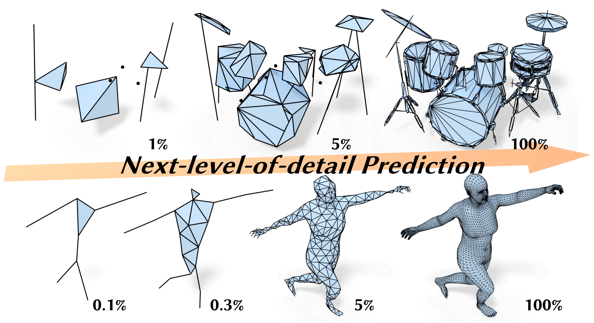

# ARMesh: Autoregressive Mesh Generation via Next-Level-of-Detail Prediction

> [!WARNING]
> This is an early access version, and the file content may change frequently in the coming days.





## Installation

### libpsc

We have packaged our core functionalities into a library called [`libpsc`](https://pypi.org/project/libpsc/), which you can install quite easily:
```bash
pip install trimesh libpsc==0.1
```

Supported platforms: 
- python 3.8 ~ 3.13
- linux, windows

You can also find all the wheels and their source code [here](https://github.com/Karbo123/armesh/assets/libpsc-0.1).


### PSC Viewer

We also provide a "progressive simplicial complex" viewer to visualize the simplification and generation process. We have provided two pre-built executables that should run perfectly on Windows and Linux, which can be downloaded from [here](https://github.com/Karbo123/armesh/assets/viewer).

To use the executable, you may follow the steps below.

xxxx


### Experimental Environment

xxx


## Examples

### xxx


## BibTex

If you find our work useful or use any part of our code, please consider citing our paper; your recognition means a great deal to us!
```
@misc{lei2025armeshautoregressivemeshgeneration,
      title={ARMesh: Autoregressive Mesh Generation via Next-Level-of-Detail Prediction}, 
      author={Jiabao Lei and Kewei Shi and Zhihao Liang and Kui Jia},
      year={2025},
      eprint={2509.20824},
      archivePrefix={arXiv},
      primaryClass={cs.GR},
      url={https://arxiv.org/abs/2509.20824}, 
}
```

